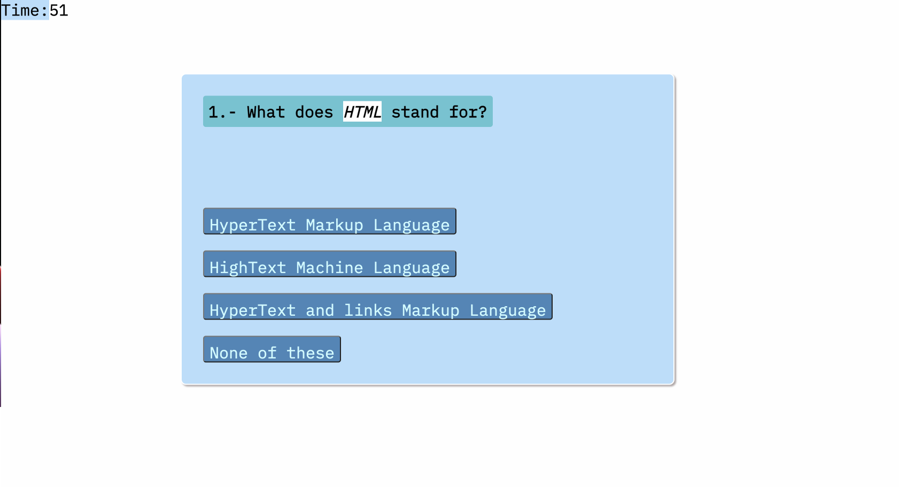
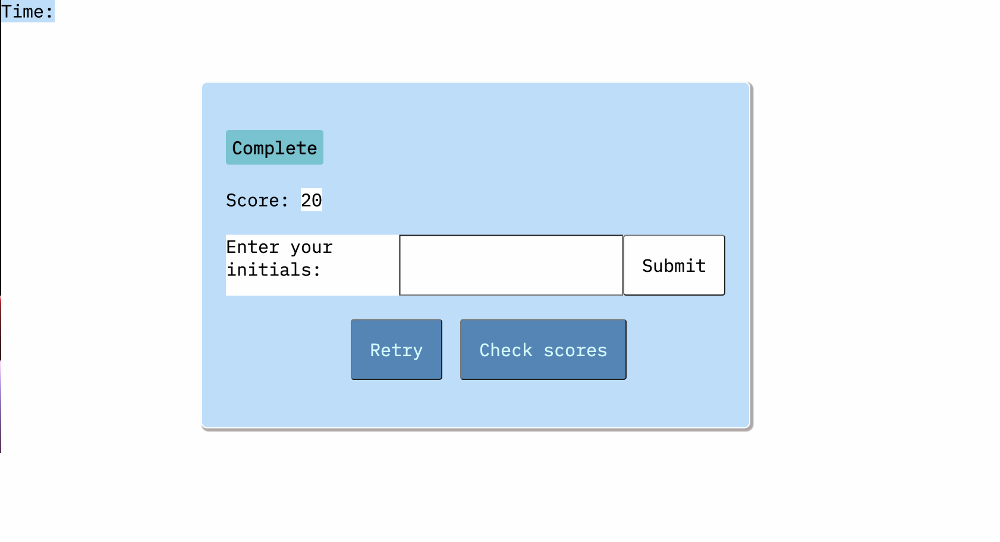
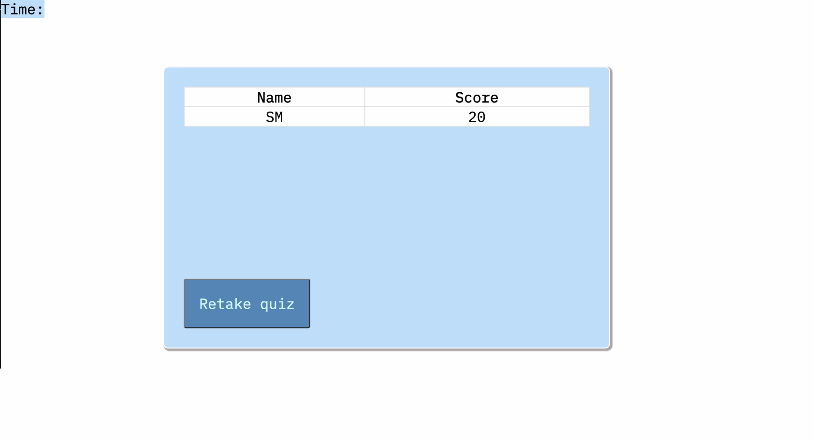

# Timed Coding Quiz

## Description

The quiz includes 10 questions based on *HTML*, *CSS* and *Javascript*. It includes a timer and keeps track of your score.

This project was useful in making me understand the concepts of DOM manipulation.

## Usage

*enter github page link here*

The quiz and timer will start when you click "START QUIZ".

![First section of quiz webpage]
(./assets/images/quiz-start.png)

The set of questions will appear. The question will change once you choose an answer.

The quiz ends after the timer reaches zero or if you answer all the questions. It will show your overall score. Score is based out of 100 max points.

When initials are submitted, the score and initials are added into a table in the score section. 

## Credits

Useful links that helped me complete the project: 

* https://palettes.shecodes.io/
* https://fonts.google.com/
* https://bobbyhadz.com/blog/javascript-get-element-by-id-contains
* https://www.javatpoint.com/*(for the questions and choices)*
* https://stackoverflow.com/questions/26944987/show-next-previous-item-of-an-array
* https://stackoverflow.com/questions/28535226/javascript-how-to-show-the-next-div-and-hide-the-previous-one

## License

MIT License

Copyright (c) 2023 Salvador M

Permission is hereby granted, free of charge, to any person obtaining a copy
of this software and associated documentation files (the "Software"), to deal
in the Software without restriction, including without limitation the rights
to use, copy, modify, merge, publish, distribute, sublicense, and/or sell
copies of the Software, and to permit persons to whom the Software is
furnished to do so, subject to the following conditions:

The above copyright notice and this permission notice shall be included in all
copies or substantial portions of the Software.

THE SOFTWARE IS PROVIDED "AS IS", WITHOUT WARRANTY OF ANY KIND, EXPRESS OR
IMPLIED, INCLUDING BUT NOT LIMITED TO THE WARRANTIES OF MERCHANTABILITY,
FITNESS FOR A PARTICULAR PURPOSE AND NONINFRINGEMENT. IN NO EVENT SHALL THE
AUTHORS OR COPYRIGHT HOLDERS BE LIABLE FOR ANY CLAIM, DAMAGES OR OTHER
LIABILITY, WHETHER IN AN ACTION OF CONTRACT, TORT OR OTHERWISE, ARISING FROM,
OUT OF OR IN CONNECTION WITH THE SOFTWARE OR THE USE OR OTHER DEALINGS IN THE
SOFTWARE.
